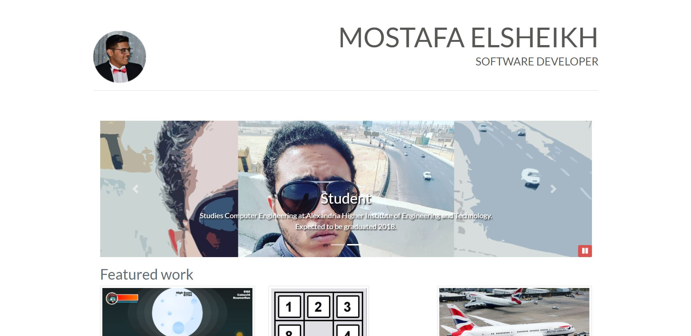

## Build a Portfolio Site: Mostafa Elsheikh
by Mostafa Elsheikh, in fulfillment of Udacity's <i class="icon-cog"></i> **[Full Stack Web Developer Nanodegree](https://www.udacity.com/course/nd004)**
### About
Server-side code to store a list of your favorite movies, including box art imagery and a movie trailer URL. Generate a static web page allowing visitors to browse their movies and watch the trailers.
### How to run
To run the script, clone this repository directory <i class="icon-folder-open"></i> and run <i class="icon-file"></i> `fresh_potatoes.py`.
Or you can view the page by opening <i class="icon-file"></i> `fresh_potatoes.html`.
### Preview
